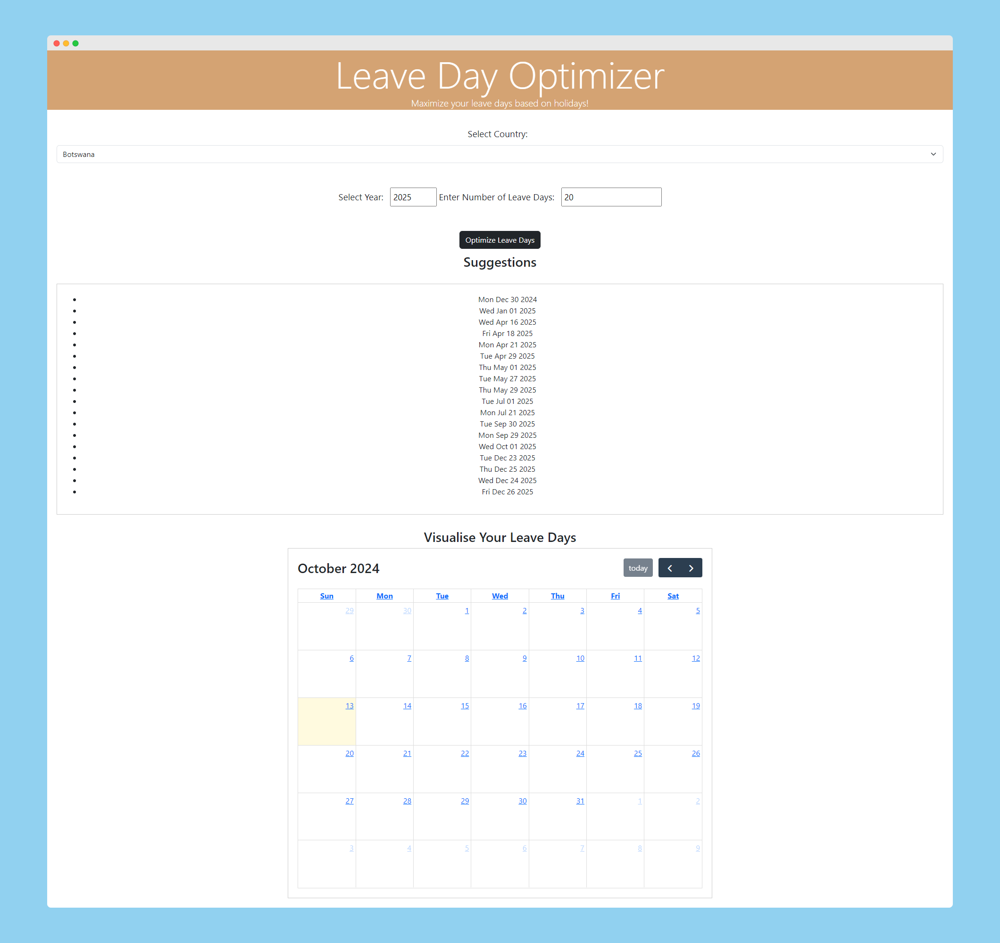

# Leave Day Optimizer

**Maximize your leave days based on holidays!**

The Leave Day Optimizer is a web-based application that helps you optimize your leave days by suggesting the best dates to take off, factoring in public holidays. This tool provides a visualization of the chosen leave days on a calendar to help users better plan their vacations and maximize their time off.

## Features

- **Country Selection**: Choose your country to retrieve applicable public holidays.
- **Year Selection**: Select the year for which you want to optimize your leave days.
- **Leave Days Input**: Input the number of leave days you wish to take.
- **Leave Suggestions**: Receive optimized suggestions for which days to take off, minimizing the number of workdays taken by maximizing holidays.
- **Visual Calendar**: View a calendar representation of the leave days for the selected year, helping you visualize your optimized leave days.

## Screenshot



## Usage

1. Select your country from the dropdown menu.
2. Choose the year you wish to plan your leave for.
3. Enter the number of leave days you want to take.
4. Click the "Optimize Leave Days" button to get suggestions based on public holidays in your selected country.
5. Scroll down to view a list of the suggested days off.
6. Visualize your leave days on the calendar below the suggestions.

## Installation

1. Clone the repository to your local machine:
   ```bash
   git clone https://github.com/your-username/leave-day-optimizer.git
   ```

2. Navigate to the project directory
    ```bash
    cd leave-day-optimizer
    ```

3. Install the necessary dependencies
    ```bash
    npm install
    ```

4. Start the application
    ```bash
    npm start
    ```

## Built With
- Frontend: HTML, CSS, JavaScript
- Backend: Node.js
- Calendar Library: [fullcalendar@6.1.15](https://cdn.jsdelivr.net/npm/fullcalendar@6.1.15/index.global.min.j)
- Country & Holiday Data API: [nager API](https://date.nager.at/Api/v3/PublicHolidays/)

